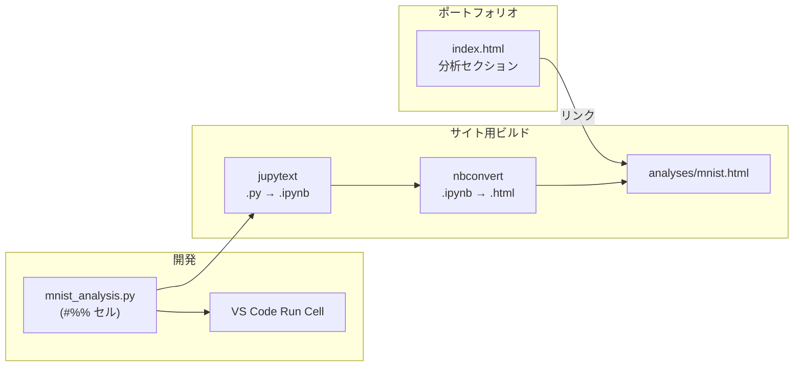

# MNIST 手書き文字認識（ポートフォリオ用）実装計画

## 成果物の流れ




## 1. フォルダ構成

```
portfolio/
├── index.html
├── css/
├── js/
├── analyses/
│   ├── mnist.html          # ビルド出力（nbconvert で生成）
│   └── mnist/              # MNIST 分析用ソース
│       ├── mnist_analysis.py   # メインの .py（#%% セル）
│       └── requirements.txt  # 分析用依存（tensorflow, matplotlib, jupytext 等）
└── (既存)
```

- ソースは [analyses/mnist/mnist_analysis.py](analyses/mnist/mnist_analysis.py) に集約する。
- 生成 HTML は [analyses/mnist.html](analyses/mnist.html) に出力し、トップからリンクする。

## 2. MNIST 分析スクリプト（mnist_analysis.py）の内容

- **形式**: VS Code の「Run Cell」用に `# %%` でセル分割。マークダウン説明は `# %% [markdown]` で記載。
- **データ**: `tf.keras.datasets.mnist.load_data()` で取得（初回のみダウンロード）。
- **モデル**: シンプルな CNN または Dense モデル（CPU でも数分で学習できる規模）。例: Conv2D → MaxPooling → Flatten → Dense(128) → Dropout → Dense(10, softmax)。
- **処理の流れ**:
  1. データ読み込み・正規化・形状確認
  2. サンプル画像の表示（例: 先頭 10 枚を 2x5 でプロット）
  3. モデル定義・コンパイル・学習（epoch 数は 3〜5 程度で短め）
  4. テスト評価（accuracy 表示）
  5. 混同行列（confusion matrix）の可視化
  6. 誤分類サンプルの可視化（任意で数枚）
- **保存**: グラフは `plt.savefig()` で PNG 等に保存し、セル出力に含める。モデルは `model.save()` で保存してもよいが、レポート用には必須ではない。
- **日本語表示**: 図のラベルで日本語を使う場合は `plt.rcParams['font.family']` で Noto Sans JP 等を指定するか、英語ラベルのみにしてフォント依存を避ける。

## 3. 依存関係（analyses/mnist/requirements.txt）

- `tensorflow`（または `tensorflow-cpu`）: MNIST 取得 + モデル学習
- `matplotlib`, `numpy`: 可視化・配列操作
- `jupytext`: .py → .ipynb 変換用
- `jupyter`, `nbconvert`: .ipynb → .html 用  
必要に応じて `scikit-learn`（混同行列の計算・描画）を追加。

## 4. サイト用 HTML の生成手順

1. `analyses/mnist/` で: `jupytext mnist_analysis.py -o mnist_analysis.ipynb`
2. `jupyter nbconvert --to html mnist_analysis.ipynb --output-dir ../ --output mnist.html`
3. 生成された [analyses/mnist.html](analyses/mnist.html) をそのまま公開用とする。

（任意）ビルド用に `analyses/mnist/build.bat` や `build.sh` で上記コマンドをまとめてもよい。

## 5. ポートフォリオトップページの更新

- [index.html](index.html) に「分析」セクションを追加する。
  - セクション id: `id="analyses"`（ナビのアンカー用）。
  - 見出し「分析・プロジェクト」の下に、リストまたはカード形式で「MNIST 手書き数字認識」へのリンクを配置。`href="analyses/mnist.html"`（同一ウィンドウまたは `target="_blank"` は好みでよい）。
- ヘッダーのナビ [index.html](index.html) の `<ul class="nav-list">` に「分析」リンクを追加する。例: `<li><a href="#analyses">分析</a></li>`。

## 6. 実装時の注意

- 学習時間を抑えるため、epoch 数とモデル規模は小さめにする（再現性のため固定の `random_seed` を設定するとよい）。
- nbconvert した HTML はスタンドアロンなので、既存の [css/style.css](css/style.css) は適用されない。レポート専用の見た目で問題ない想定とする。
- データパスは `mnist_analysis.py` を `analyses/mnist/` から実行する前提で相対パスやデフォルトの Keras キャッシュに依存する形にするとよい。

## まとめ


| 項目   | 内容                                                                                              |
| ---- | ----------------------------------------------------------------------------------------------- |
| 実装対象 | [analyses/mnist/mnist_analysis.py](analyses/mnist/mnist_analysis.py)（#%% セル形式）                  |
| モデル  | Keras のシンプルな CNN または Dense（MNIST 用）                                                             |
| 出力   | サンプル画像・精度・混同行列・誤分類例の図をレポートに含める                                                                  |
| 公開   | nbconvert で [analyses/mnist.html](analyses/mnist.html) を生成し、[index.html](index.html) の「分析」からリンク |


