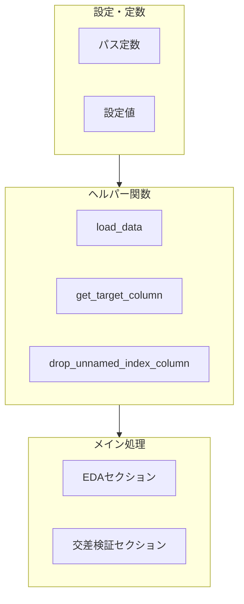

# Mohs硬度分析コード整理計画

## 現状の課題

### 1. コードの構造

- **直線的なスクリプト**: データ読み込み・EDA・モデル学習が一続きで、再利用やテストが困難
- **重複コード**: `target_col` の取得ロジックが df_artificial と df_mineral で2回出現
- **重複 import**: `lightgbm` が 52 行目と 369 行目で二重に import
- **デバッグ用コード**: `_agent_log` と H1〜H5 の agent log ブロックが本番分析に不要と思われる

### 2. requirements.txt の不足

- **lightgbm** と **scikit-learn** が未記載（分析に必須なのに requirements に含まれていない）

---

## 整理方針

### フェーズ1: requirements.txt の更新

[analyses/mohs_hardness/requirements.txt](analyses/mohs_hardness/requirements.txt) に以下を追加:

```
lightgbm>=4.0
scikit-learn>=1.0
```

既存パッケージはそのまま維持（jupytext, jupyter, nbconvert は build.bat で使用）。

---

### フェーズ2: コードのリファクタリング

[mohs_hardness_analysis.py](analyses/mohs_hardness/mohs_hardness_analysis.py) を以下の構成に整理:




#### 2.1 デバッグコードの削除

- `_agent_log` 関数および呼び出し（H1〜H5, RUN_ID）を削除
- `inspect`, `json`, `os`, `time` のうちデバッグ専用の import を削除

#### 2.2 定数・設定の集約

- `DATA_DIR`, `CRYSTALS_PATH`, `MINERAL_PATH` をファイル先頭にまとめる

#### 2.3 ヘルパー関数の抽出

- `load_data()`: CSV 読み込みと Unnamed 列の削除を集約
- `get_target_column(df, default_last=True)`: 目的変数列の取得ロジックを共通化
- `drop_unnamed_index_column(df)`: Unnamed: 0 削除を関数化

#### 2.4 メイン処理の整理

- **EDA セクション**: 1〜6 の確認（shape, 列情報, 欠損, describe, 目的変数, ヒストグラム・pairplot）は流れを維持しつつ、`get_target_column` を利用
- **LightGBM セクション**: `run_lightgbm_cv()` のような関数にまとめるか、少なくともセクションコメントで区切る
- RMSE 計算: `mean_squared_error(..., squared=False)` に統一（sklearn 1.4+ では `root_mean_squared_error` が推奨だが、`squared=False` は広くサポートされている）

#### 2.5 その他の修正

- 重複 import（369行目の `import lightgbm`）を削除
- `df_mineral.head()` が `df_mineral is None` のときにエラーになる可能性を修正
- 256行目: `numeric_cols_mineral` は未使用のため削除

---

## ファイル構成（変更後）

```
analyses/mohs_hardness/
├── mohs_hardness_analysis.py  （リファクタ後）
├── requirements.txt           （lightgbm, scikit-learn 追加）
├── build.bat                  （変更なし）
├── data/
└── outputs/
```

---

## 注意事項

- **Jupytext 互換**: `#%%` と `#%% [markdown]` のセル区切りは維持し、build.bat による .ipynb → .html 変換が問題なく動作するようにする
- **出力の一貫性**: print や可視化の出力内容は従来と同等とする
- **既存 outputs/**: スクリプトは outputs/ への直接書き込みを行っていないため、出力形式の変更は不要

